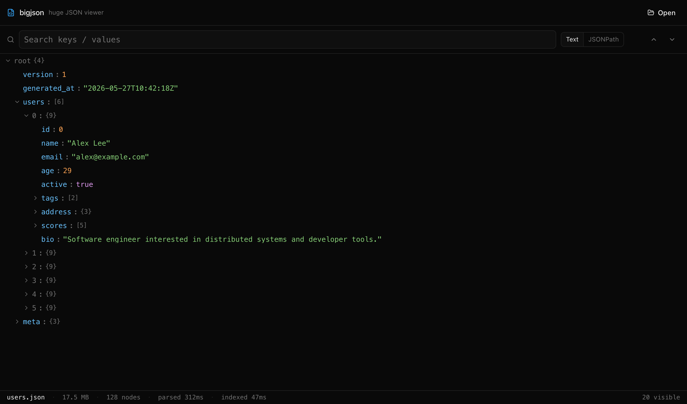
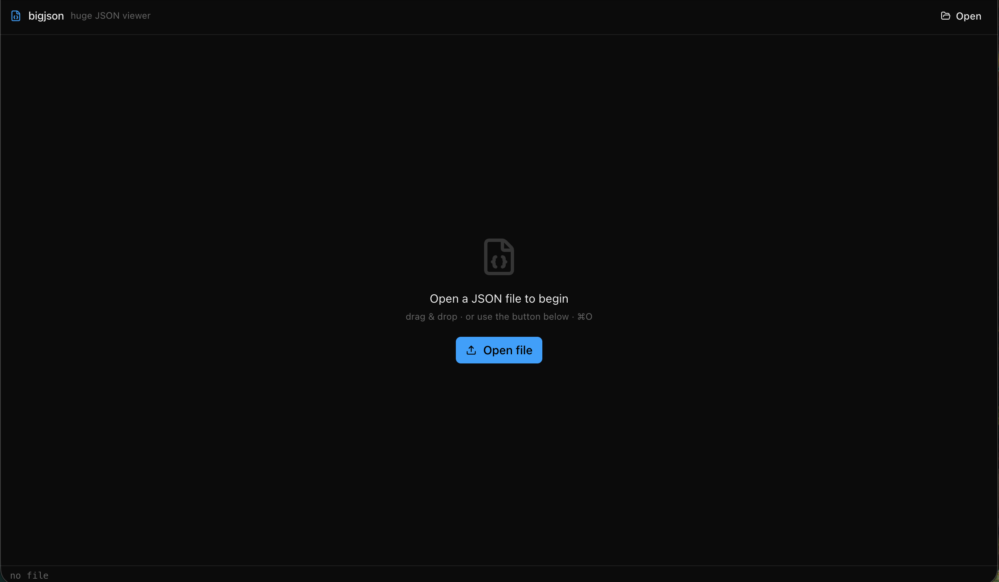
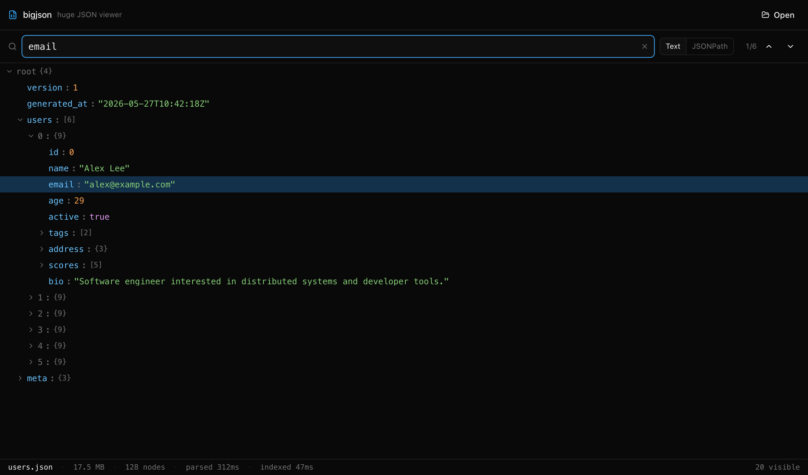
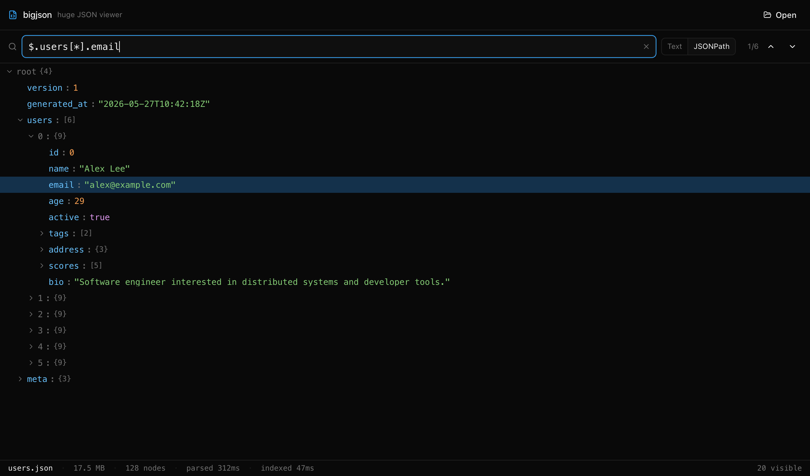

## [DOWNLOAD](https://github.com/hi-malay/bigJson/releases)

# bigJson huge JSON file viewer for macOS, Windows, and Linux

**Fast, native desktop JSON viewer for large files.** Open 100MB, 500MB, even multi-GB JSON files instantly. Built with Tauri, Rust (`simd-json`), and React. A free, open-source alternative to Dadroit for inspecting big JSON, log dumps, API exports, and analytics datasets that crash VS Code, Sublime Text, and other text editors.

**Keywords:** huge JSON viewer · large JSON file viewer · JSON viewer 100MB · big JSON file editor · fast JSON parser desktop app · Dadroit alternative · macOS JSON viewer · Windows JSON viewer · Linux JSON viewer · open large JSON file · JSONPath search GUI · JSON tree viewer.



## Download

Latest release: [github.com/hi-malay/bigJson/releases/latest](https://github.com/hi-malay/bigJson/releases/latest)

- **macOS** (Intel + Apple Silicon, universal): [bigJson_0.1.3_universal.dmg](https://github.com/hi-malay/bigJson/releases/latest/download/bigJson_0.1.3_universal.dmg)
- **Windows** (x64): [bigJson_0.1.3_x64-setup.exe](https://github.com/hi-malay/bigJson/releases/latest/download/bigJson_0.1.3_x64-setup.exe) or [bigJson_0.1.3_x64_en-US.msi](https://github.com/hi-malay/bigJson/releases/latest/download/bigJson_0.1.3_x64_en-US.msi)
- **Linux AppImage** (x64): [bigJson_0.1.3_amd64.AppImage](https://github.com/hi-malay/bigJson/releases/latest/download/bigJson_0.1.3_amd64.AppImage)
- **Linux .deb** (Debian/Ubuntu): [bigJson_0.1.3_amd64.deb](https://github.com/hi-malay/bigJson/releases/latest/download/bigJson_0.1.3_amd64.deb)
- **Linux .rpm** (Fedora/RHEL): [bigJson-0.1.3-1.x86_64.rpm](https://github.com/hi-malay/bigJson/releases/latest/download/bigJson-0.1.3-1.x86_64.rpm)

All builds are **unsigned**. First-launch workarounds:
- macOS: right-click → Open, or run `xattr -cr /Applications/bigJson.app`
- Windows: SmartScreen blocks it → click "More info" → "Run anyway"
- Linux AppImage: `chmod +x bigJson_*.AppImage && ./bigJson_*.AppImage`

## Why bigJson (vs VS Code, Sublime, Notepad++, Online JSON viewers)

VS Code and other text editors treat JSON as editable text UTF-16 string in RAM, tokenizer, syntax highlighter, undo buffer, plugins. That's why they freeze on 100MB+ files. Online JSON viewers can't handle anything past ~10MB and you'd never paste private data there anyway. bigJson is a **read-only viewer** that parses the file natively in Rust, builds a flat index of every node, and renders only the rows visible on screen. RAM usage stays close to the file size instead of 3-10×.

## Features

- **Open huge JSON files instantly** 100MB in under a second, no UI freeze.
- **Virtualized tree** millions of nodes scroll smoothly because only ~50 visible rows render at a time.
- **Lazy expansion** children load on demand, even arrays with hundreds of thousands of entries.
- **Text search** across keys and values (case-insensitive).
- **JSONPath search** `$.users[*].email`, `$.orders[?(@.total > 1000)]`, etc.
- **Copy node value** (pretty-printed subtree) or **copy JSONPath** for any node.
- **Drag-and-drop** files onto the window, or use the ⌘O shortcut.
- **Native macOS, Windows, and Linux** builds. No browser required.
- **Open source** under MIT. Built with [Tauri 2](https://tauri.app), Rust, and React.

## Screens

|  |  |
|---|---|
|  |  |
| _Empty state drag-drop or ⌘O to open_ | _Text search across keys + values_ |
|  |  |
| _Lazy virtualized tree_ | _JSONPath mode_ |

## Run

```bash
npm install
npm run tauri dev          # dev, ~1 min first compile
npm run tauri build        # release .app / .dmg
```

## Test fixtures

```bash
node scripts/gen-fixtures.mjs    # tiny / small / medium JSON in fixtures/
```

## Stack

```
React + Vite + Tailwind 4  ←→  Tauri commands  ←→  Rust (simd-json + flat index)
```

`src/` is the frontend. `src-tauri/src/` is the Rust core (`parser.rs`, `index.rs`, `search.rs`, `commands.rs`). The `Index` is a flat `Vec<Node>` plus a `child_ids` arena node-id lookups are O(1), no per-node heap allocations beyond the previews.

## Not yet

Files larger than RAM, raw text view, diff editor, code-signing/notarization. v2.

## FAQ

**How big a JSON file can bigJson open?**
On a machine with 16GB of RAM it comfortably opens JSON files up to ~3GB. v2 will add memory-mapped streaming for files larger than RAM.

**Is bigJson free?**
Yes MIT licensed, no telemetry, no ads, no sign-in.

**Does bigJson work offline?**
Yes. It's a native desktop app no network calls, no cloud parsing, no data leaves your machine.

**Does bigJson edit JSON or just view it?**
View only. The goal is fast inspection of large files; an edit mode would require an undo stack and other machinery that defeats the speed advantage.

**Is bigJson a Dadroit alternative?**
That's the inspiration. bigJson is open-source and free. Dadroit is closed-source with a free tier.

**Why does macOS / Windows warn on first launch?**
The release binaries are unsigned (no Apple Developer Program / Authenticode signing fees yet). See the [Download](#download) section for one-line workarounds per OS.

## Tags

`json` `json-viewer` `large-json` `huge-json` `json-parser` `tauri` `rust` `react` `desktop-app` `macos` `windows` `linux` `simd-json` `jsonpath` `developer-tools` `dadroit-alternative` `data-inspection` `log-viewer`
